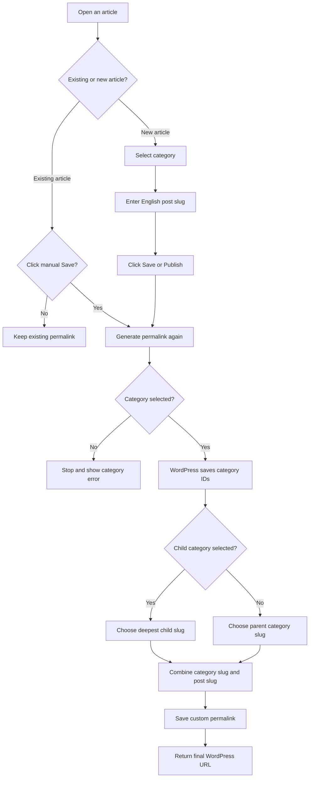

# Article permalink save flow

## Steps

1. Open an existing article or create a new article.
2. For an existing article:
   - Without a manual save, keep the existing permalink.
   - On manual save, generate the permalink again.
3. For a new article, select a category and enter an English post slug.
4. Click **Save** or **Publish**.
5. If no category is selected, stop and display a category error.
6. WordPress saves the selected category IDs.
7. When a child category is selected, use the deepest child category slug.
   Otherwise, use the parent category slug.
8. Combine the selected category slug with the post slug.
9. Save the custom permalink and return the final WordPress URL.

## Flowchart

